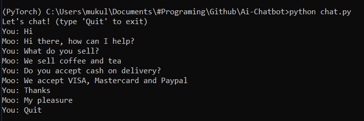

# Ai Chatbot
 This is a prototype of an Ai Chatbot which was made for coffee supplier company. The bot will answer your queries regarding the cost, availability, and delievery of the coffee of your choice.\
 
 
This project was made during my 2020 Summer Intern at Cloud Counselge. 

# How to use?
## Step 1:
Run: `python train.py`
#### This will give a `data.pth` file

## Step 2:
Run: `python chat.py`
### Now you can start chatting

## Step 3:
#### To Exit the bot
Run: `Quit`
